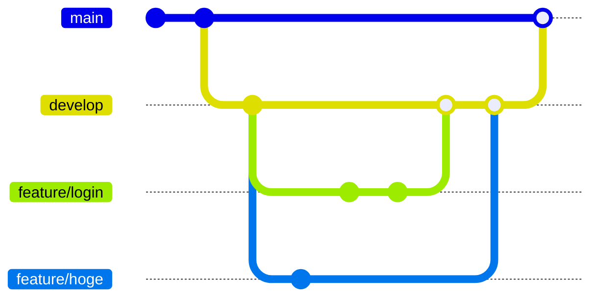

# web-programming
## 概要
このリポジトリは土曜1、２限の授業(Webプログラミング)で使用するリポジトリです。

## 環境構築手順
> [!NOTE]
> 必須なソフトウェア <br>
> Docker, Git, IntelliJ([学生プランを使用すること](https://blog.jetbrains.com/ja/2019/08/22/2105/))
```bash
git clone https://github.com/naoido/web-programming.git
```

## 開発手順
- まず自分のやることをIsuueを立てる
- ローカルでブランチを作成する
- ローカルで変更を加えたのち、コミットし、プッシュする
- Issueに関連させ、プルリクエストを作成する
- 私のコードレビュー後マージする

## Git Flow

